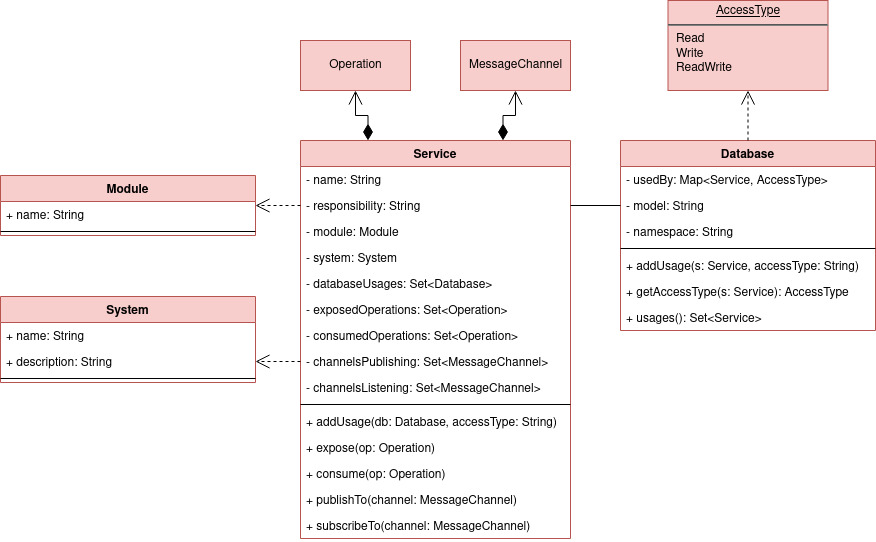
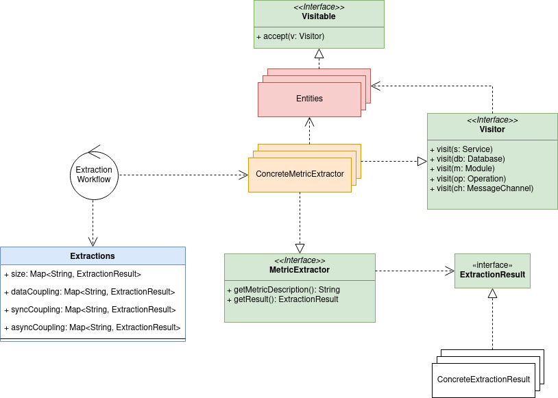

# Metrics Extractor

A service responsible for extracting the metrics of the CharM model.

## About CharM

CharM is a model for characterization of the architecture of service-based systems. It characterizes a service-based system in 4 dimensions: Size, Data source coupling, Synchronous coupling and Asynchronous coupling.

### Dimensions and their metrics

#### Size

The goal is to characterize the composition of different components of a system and compare them.

Components: Module (a deployment unit) and Service (an application application with cohesive and well-defined responsibility, that implements functionalities related to business tasks).

Metrics:

- Number of system’s components
- Number of services per module
- Number of operations per component
- Number of services with deployment dependency

#### Data source coupling

The goal is to characterize the data source sharing strategy between the components of a system.

Metrics:

- Number of system’s data sources
- Number of data sources per component
- Number of data sources that each component shares with others
- Number of data sources where each component performs write-only operation
- Number of data sources where each component performs read-only operation
- Number of data sources where each component performs read and write operations

#### Synchronous coupling

The goal is to characterize the components synchronous interactions of a system.

Metrics:

- Number of clients that invoke the operations of a given component
- Number of components from which a given component invokes operations
- Number of different operations invoked by each depending component
- Number of different operations invoked from other components

#### Asynchronous coupling

The goal is to characterize the components asynchronous interactions of a system.

Metrics:

- Number of clients that consume messages published by a given component
- Number of components from which a given component consumes messages
- Number of different types of messages consumed by each depending component
- Number of different types of messages consumed from other components
- Number of components that consume messages from the queue
- Number of components that publish messages in the queue

## Architecture

### Core entities

### Domain Overview

Color Legend:

- Red: domain entities
- Green: domain behaviors
- Yellow: domain services

### API

The application exposes two routes:

- GET /systems/{name}: to get a specific system data.
- GET /systems/{name}/metrics: to get the value of each metric for a specific system.

### Application Workflow

Actually, the application fetches the systems from google spreadsheets every time a new request is made. There are two systems available: InterSCity and TrainTicket.
